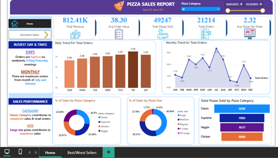
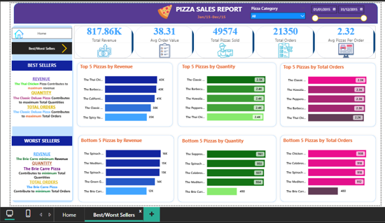

# 🍕 Pizza Sales Analysis

## Project Overview
This project analyzes pizza sales data to uncover key business insights using SQL, 
Excel, and Power BI. The goal was to understand sales trends, category performance, 
and identify the best and worst performing pizzas.

## Tools Used
- **SQL** – Data extraction and querying
- **Excel** – Data cleaning and preparation
- **Power BI** – Interactive dashboard and visualizations

## Key Insights & Visuals
The dashboard covers the following:

- 📅 **Daily & Monthly Trends** – Track how total pizza orders fluctuate over time
- 🍕 **Sales by Category & Size** – Percentage breakdown of revenue across pizza 
  categories and sizes
- 🏆 **Top 5 Best Sellers** – Ranked by revenue, quantity sold, and number of orders
- ❌ **Bottom 5 Sellers** – Ranked by revenue, quantity sold, and number of orders 
  to identify underperforming items

## Dashboard Preview

## How to Use
1. Open the `.pbix` file in Power BI Desktop
2. Refer to the SQL folder for all queries used in the analysis
3. The Excel file contains the cleaned dataset
